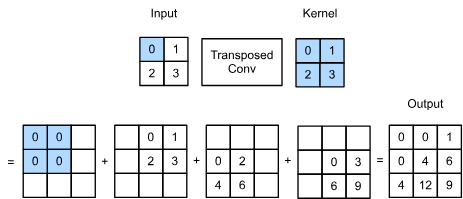
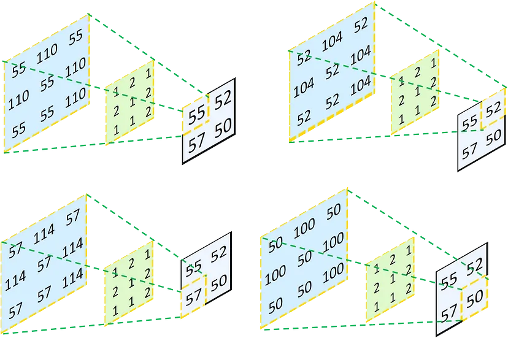
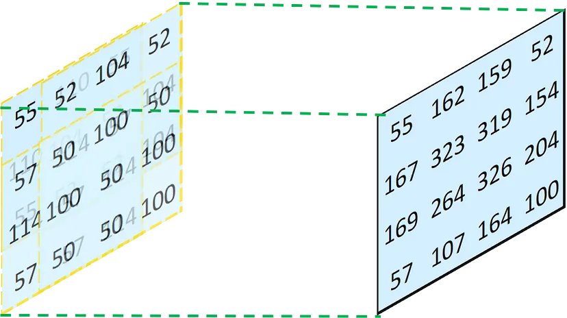
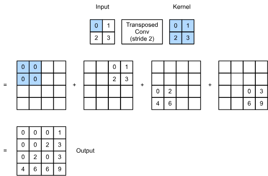

Transpose convolution or fractional strided convolution.
Originally from [here](https://ieeexplore.ieee.org/abstract/document/5539957)

from [this site](http://d2l.ai/chapter_computer-vision/transposed-conv.html)
`
def trans_conv(X, K):

    h, w = K.shape

    Y = torch.zeros((X.shape[0] + h - 1, X.shape[1] + w - 1))

    for i in range(X.shape[0]):

        for j in range(X.shape[1]):

            Y[i: i + h, j: j + w] += X[i, j] * K

    return Y
`
algebraically

graphically taken from [here](https://towardsdatascience.com/understand-transposed-convolutions-and-build-your-own-transposed-convolution-layer-from-scratch-4f5d97b2967)

and the result is

### With stride of 2

